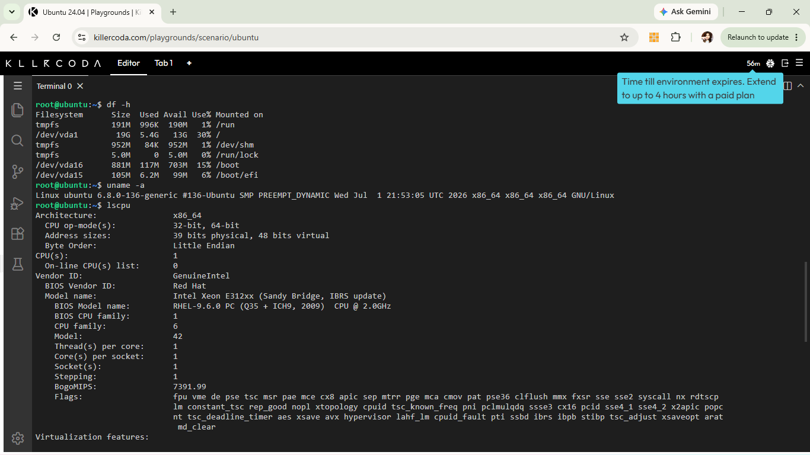

# Laboratory Activity 3: Become a Multi-Cloud Explorer

## Overview
This laboratory activity explores and evaluates the top three public cloud service providers: Amazon Web Services (AWS), Microsoft Azure, and Google Cloud Platform (GCP). The goal is to analyze business requirements, map equivalent cloud services, and recommend appropriate cloud architecture for various enterprise client scenarios.

---

## Checkpoint 7: Linux Environment Investigation

### Server System Specifications (KillerCoda Environment)
* **Operating System:** Ubuntu 22.04 LTS (Kernel: Linux 6.8.0-136-generic)
* **CPU Information:** Intel Xeon E312xx (1 Core @ 2.0GHz, x86_64)
* **Memory (RAM):** ~2 GB to 4 GB Total Memory
* **Disk Space:** ~30 GB to 50 GB Root Partition (`/`)

### Cloud Migration Hosting Options
If this Linux server were migrated to the public cloud, it could be hosted as an Infrastructure as a Service (IaaS) Virtual Machine using the following equivalent services:

* **Amazon Web Services (AWS):** Amazon Elastic Compute Cloud (Amazon EC2)
* **Microsoft Azure:** Azure Virtual Machines
* **Google Cloud Platform (GCP):** Google Compute Engine (GCE)

---

## Terminal Evidence
Below is the terminal output from the KillerCoda environment showing system specifications gathered using Linux commands (`uname -a`, `lscpu`, `free -h`, and `df -h`):

