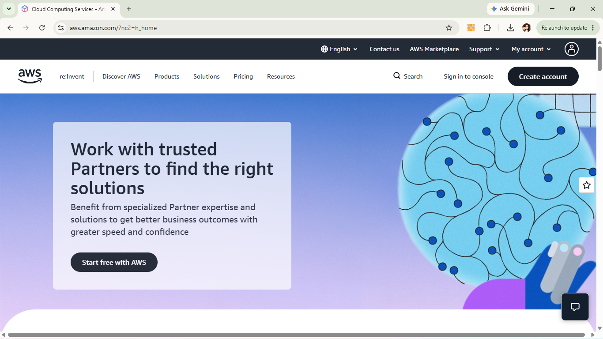

# AWS Platform Research

## 1. Brief Overview
Amazon Web Services (AWS) launched in 2006 and is the pioneer and market leader in cloud computing. It provides a comprehensive, feature-rich set of infrastructure and platform services.

## 2. Global Infrastructure
AWS operates across numerous Regions and Availability Zones (AZs) worldwide, connected via a dedicated high-bandwidth network backbone. Each region consists of multiple isolated AZs for high availability.

## 3. Cloud Management Console
The AWS Management Console provides a web-based graphical interface, AWS CLI, and SDKs to manage all cloud resources efficiently.

## 4. Four Core Services
* **Compute:** Amazon EC2 (Elastic Compute Cloud) – Resizable compute capacity in the cloud.
* **Storage:** Amazon S3 (Simple Storage Service) – Scalable object storage for data backup and analytics.
* **Networking:** Amazon VPC (Virtual Private Cloud) – Isolated virtual network environment.
* **Identity:** AWS IAM (Identity and Access Management) – Granular access control for AWS resources.

## 5. Three Key Advantages
1. First-mover advantage with the broadest ecosystem of third-party tools.
2. Unrivaled range and depth of specialized services.
3. Extensive global footprint and market adoption.

## 6. Typical Enterprise Use Cases
* Web application hosting and auto-scaling.
* Enterprise data warehousing and big data pipelines.
* Hybrid cloud infrastructure extensions.
---

