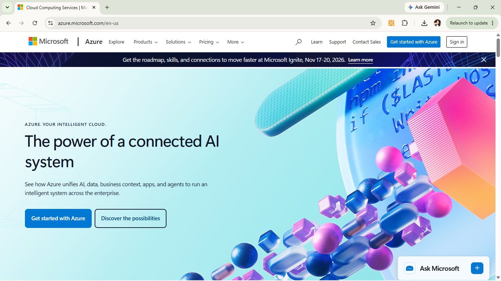

# Microsoft Azure Research Report

## Brief Overview
[cite_start]Microsoft Azure is a leading cloud computing platform provided by Microsoft[cite: 78]. It offers a comprehensive suite of cloud services including compute, analytics, storage, and networking. Azure is particularly known for its seamless integration with existing enterprise Microsoft products, making it a primary choice for organizations with established Windows-based infrastructures.

## Global Infrastructure
Azure operates one of the largest global cloud infrastructures in the world, spanning over 60+ regions and hundreds of availability zones globally. Its extensive network of datacenters allows businesses to deploy applications close to their users with low latency, high availability, and strong data redundancy.

## Cloud Management Console
The **Azure Portal** is the centralized, web-based management console for configuring and monitoring Azure resources. It features customizable dashboards, an integrated Cloud Shell (Bash and PowerShell), and unified governance tools to manage billing, security, and deployment metrics from a single interface.

## Four (4) Core Services
1. **Azure Virtual Machines (Compute):** Provides scalable, on-demand Linux and Windows virtual machines in the cloud.
2. **Azure Blob Storage (Storage):** Massively scalable object storage designed for unstructured data such as files, images, videos, and backups.
3. **Azure Virtual Network / VNet (Networking):** Enables secure private networks in Azure to isolate resources and connect securely to on-premises datacenters.
4. **Microsoft Entra ID / formerly Azure Active Directory (Identity):** Cloud-based identity and access management service for managing user identities and security permissions.

## Three (3) Advantages
* **Seamless Microsoft Integration:** Native compatibility with Windows Server, Active Directory, SQL Server, and Microsoft 365.
* **Strong Hybrid Cloud Capabilities:** Excellent support for hybrid environments using tools like Azure Arc and Azure Stack.
* **Flexible Licensing & Cost Savings:** Offers hybrid benefits for existing Windows Server and SQL Server software licenses.

## Typical Enterprise Use Cases
* Migrating on-premises Windows enterprise workloads to the cloud.
* Enterprise Identity and Access Management (IAM) integrated with Microsoft 365.
* Hybrid cloud infrastructure setups connecting private datacenters to public cloud resources.
