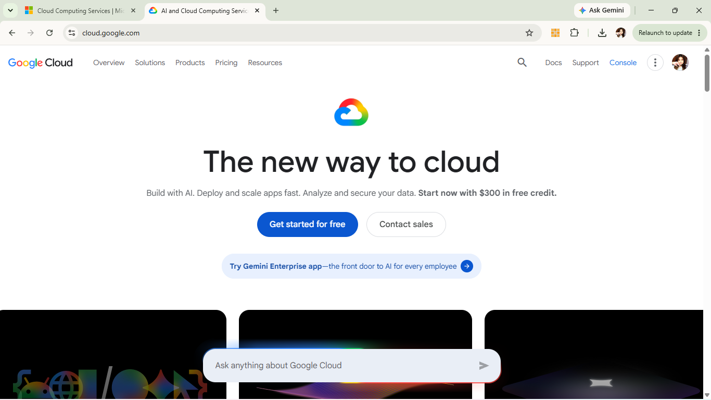

# Google Cloud Platform (GCP) Research Report

## Brief Overview
[cite_start]Google Cloud Platform (GCP) is a suite of cloud computing services offered by Google[cite: 79]. [cite_start]Built on the same infrastructure that Google uses internally for products like Search and YouTube, GCP excels at high-performance computing, advanced data analytics, artificial intelligence, and containerized application management[cite: 79, 100].

## Global Infrastructure
GCP’s global network uses Google's private, ultra-fast fiber-optic backbone. It is divided into numerous regions and availability zones worldwide, providing exceptional interconnectivity, low latency, and high bandwidth across international locations.

## Cloud Management Console
The **Google Cloud Console** is a clean, modern web interface used to create, manage, and monitor GCP services. It includes an embedded Google Cloud Shell terminal, real-time resource tracking, and integrated analytics tools to manage infrastructure effortlessly.

## Four (4) Core Services
1. **Google Compute Engine / GCE (Compute):** High-performance customizable virtual machines hosted on Google’s infrastructure.
2. **Google Cloud Storage (Storage):** Secure, durable, and highly available object storage for structured and unstructured data.
3. [cite_start]**Google Kubernetes Engine / GKE (Container Management):** Industry-leading managed Kubernetes service for deploying containerized applications[cite: 100].
4. [cite_start]**Vertex AI (Artificial Intelligence & ML):** Managed platform for building, training, and deploying machine learning models efficiently[cite: 100].

## Three (3) Advantages
* [cite_start]**Industry Leader in AI & Machine Learning:** Advanced AI/ML tools and hardware like Tensor Processing Units (TPUs)[cite: 100].
* **Superior Networking Infrastructure:** Powered by Google's global private fiber-optic network for superior performance.
* [cite_start]**Best-in-Class Kubernetes Support:** Native integration and pioneering innovation in container management via GKE[cite: 100].

## Typical Enterprise Use Cases
* Big Data analytics and real-time data processing.
* Training and deploying complex AI/ML models.
* [cite_start]Modern microservices architecture and Kubernetes container deployments[cite: 100].
